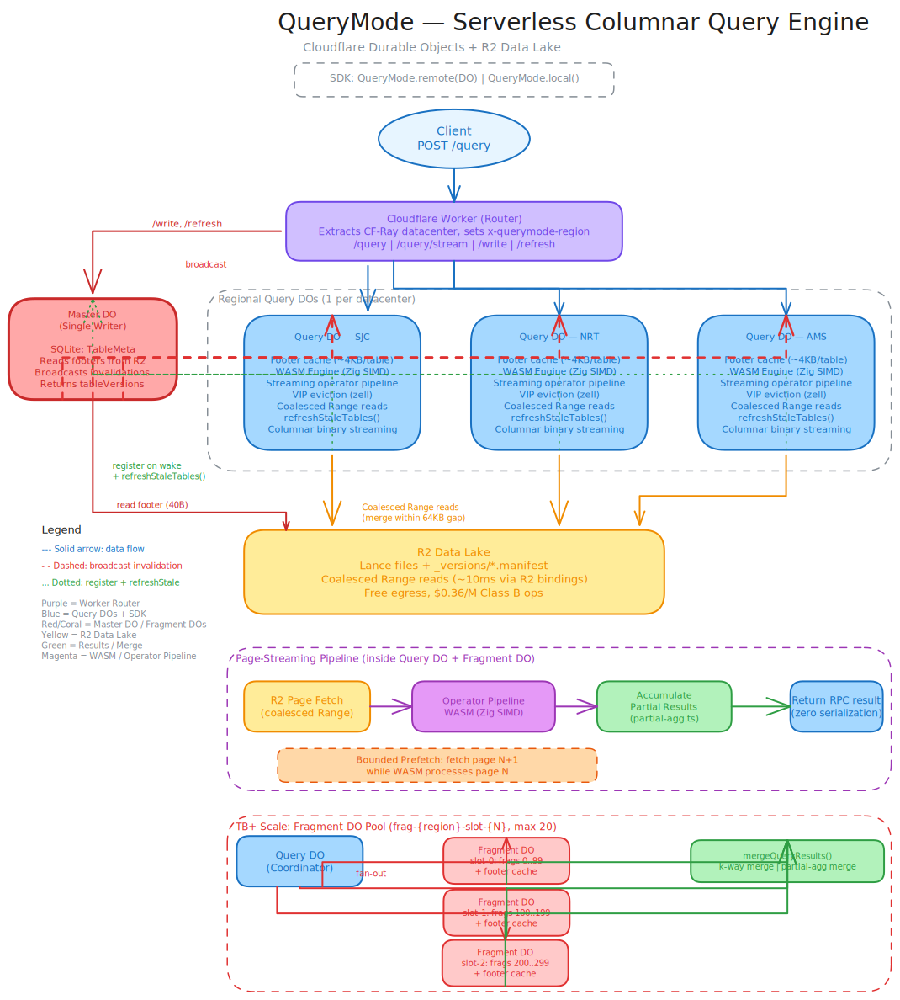

# QueryMode

> **Experimental** — early prototype, not production-ready. Architecture and API will change.

## Quickstart

```bash
# Clone and use from source (not yet published to npm)
git clone https://github.com/teamchong/querymode.git
cd querymode && pnpm install
```

```typescript
import { QueryMode } from "querymode/local"

// Zero-config: demo data, no files needed
const demo = QueryMode.demo()
const top5 = await demo
  .filter("category", "eq", "Electronics")
  .sort("amount", "desc")
  .limit(5)
  .collect()

console.log(top5.rows)

// Or query your own files — Parquet, Lance, CSV, JSON, Arrow
const qm = QueryMode.local()
const result = await qm
  .table("./data/events.parquet")
  .filter("status", "eq", "active")
  .filter("amount", "gte", 100)
  .filter("amount", "lte", 500)
  .select("id", "amount", "region")
  .sort("amount", "desc")
  .limit(20)
  .collect()
```

A pluggable columnar query library — not a query engine you push data to, but a query capability your code uses directly. No data materialization, no engine boundary, no SQL transpilation.

**[Why QueryMode?](https://teamchong.github.io/querymode/why-querymode/)** — Agents need dynamic pipelines, not pre-built ETL. QueryMode lets the agent define both query and business logic in the same code, at query time, with no serialization boundary between stages.

## Why "mode" not "engine"

Every query engine — Spark, DataFusion, DuckDB, Polars — has a boundary between your code and the engine:

```
Traditional engine:

  Your Code                      Engine
  ─────────                      ──────
  filter(age > 25)  ──────►   translate to internal plan
                               materialize data into Arrow/DataFrame
                               run engine's fixed operators
                               serialize results
                    ◄──────   return results to your code

  Your code CANNOT cross the boundary.
  Custom business logic? Pull data out, process in your code, push back in.
  That round-trip IS data materialization.
```

LINQ and ORMs look like code-first but they're transpiling expressions to SQL strings sent to a separate database. The database still materializes your data into its format, runs its fixed operators, and sends results back.

QueryMode has no boundary:

```typescript
// This IS the execution — not a description translated to SQL
const orders = await qm.table("orders").filter("amount", "gt", 100).exec()
const userIds = orders.rows.map(r => r.user_id)  // your code, zero materialization
const users = await qm.table("users").filter("id", "in", userIds).exec()

// JOIN logic, business rules, ML scoring — all your code
// WASM handles byte-level column decode + SIMD filtering
// But orchestration is YOUR code, not a query planner's fixed operators
```

Your app code IS the query execution. The WASM engine is a library function your code calls — column decoding, SIMD filtering, vector search happen in-process, on raw bytes, zero-copy. There's no "register UDF → engine materializes data → calls your function → collects results" boundary.

**What this means in practice:**
- No data materialization — data stays in R2/disk, only the exact matching bytes are read
- No engine boundary — your business logic runs directly, not as a registered UDF
- No SQL transpilation — the API calls ARE the execution, not a description sent elsewhere
- No fixed operator set — your code can do anything between query steps
- Same binary everywhere — browser, Node/Bun, Cloudflare DO

## Query engine as code

Every query operation is a composable code primitive. They all implement the same pull-based `Operator` interface — `next() → RowBatch | null` — so you chain them however you want.

```
Operation         Operator class              What it does
─────────         ──────────────              ────────────

Filtering
  predicate       FilterOperator              eq, neq, gt, gte, lt, lte, in
  membership      SubqueryInOperator          Semi-join filter against a value set

Projection
  select          ProjectOperator             Column selection
  transform       ComputedColumnOperator      Arbitrary (row: Row) => value per row

Aggregation
  group + reduce  AggregateOperator           sum, avg, min, max, count, count_distinct,
                                              stddev, variance, median, percentile
  having          FilterOperator              Filter after AggregateOperator — same primitive, you control order

Sorting
  full sort       ExternalSortOperator        Disk-spilling merge sort with R2 spill
  in-memory sort  InMemorySortOperator        In-memory sort (small datasets)
  top-K           TopKOperator                Heap-based top-K without full sort

Joining
  hash join       HashJoinOperator            inner, left, right, full, cross — Grace hash join with R2 spill

Windowing
  partition       WindowOperator              row_number, rank, dense_rank, lag, lead,
                                              rolling sum/avg/min/max/count

Deduplication
  distinct        DistinctOperator            Hash-based deduplication on column set

Set operations
  combine         SetOperator                 union, union_all, intersect, except

Limiting
  limit/offset    LimitOperator               Row limiting with offset
  sample          (planned)                   Random sampling

Similarity
  vector near     (planned)                   NEAR topK as composable operator — currently in scan layer
```

### Compose operators directly

```typescript
import {
  FilterOperator, AggregateOperator, HashJoinOperator,
  WindowOperator, TopKOperator, drainPipeline,
  type Operator, type RowBatch,
} from "querymode"

// Your data source — any async batch producer
const source: Operator = {
  async next() { /* return RowBatch or null */ },
  async close() {},
}

// Chain operators — no query planner, no SQL string
const filtered = new FilterOperator(source, [{ column: "age", op: "gt", value: 25 }])
const aggregated = new AggregateOperator(filtered, {
  table: "users", filters: [], projections: [],
  groupBy: ["region"],
  aggregates: [{ fn: "sum", column: "amount", alias: "total" }],
})
// "HAVING" is just a filter after aggregation — same operator, you control order
const having = new FilterOperator(aggregated, [{ column: "total", op: "gt", value: 1000 }])
const top10 = new TopKOperator(having, "total", true, 10)

// Pull results — zero-copy, no serialization between stages
const rows = await drainPipeline(top10)
```

### Or use the DataFrame API

The same operators power the fluent API — `.filter()` becomes `FilterOperator`, `.sort()` becomes `ExternalSortOperator`, etc:

```typescript
const qm = QueryMode.local()
const results = await qm
  .table("orders")
  .filter("amount", "gt", 100)
  .groupBy("region")
  .aggregate("sum", "amount", "total")
  .sort("total", "desc")
  .limit(10)
  .exec()
```

Both paths produce the same pull-based pipeline. The DataFrame API is sugar; the operators are the engine.

### Memory-bounded with R2 spill

Operators that accumulate state (sort, join, aggregate) accept a memory budget. When exceeded, they spill to R2 via `SpillBackend` — same interface whether running on Cloudflare edge or local disk:

```typescript
import { HashJoinOperator, ExternalSortOperator, R2SpillBackend } from "querymode"

const spill = new R2SpillBackend(env.DATA_BUCKET, "__spill/query-123")
const join = new HashJoinOperator(left, right, "user_id", "id", "inner", 32 * 1024 * 1024, spill)
const sorted = new ExternalSortOperator(join, "created_at", true, 0, 32 * 1024 * 1024, spill)
const rows = await drainPipeline(sorted)
await spill.cleanup()
```

### SQL frontend

SQL is another way in — same operator pipeline underneath:

```typescript
const qm = QueryMode.local()
const results = await qm
  .sql("SELECT region, SUM(amount) AS total FROM orders WHERE status = 'active' GROUP BY region ORDER BY total DESC LIMIT 10")
  .collect()

// SQL and DataFrame compose — chain further operations after SQL
const filtered = await qm
  .sql("SELECT * FROM events WHERE created_at > '2026-01-01'")
  .filter("country", "eq", "US")
  .sort("amount", "desc")
  .limit(50)
  .collect()
```

Supports: SELECT, WHERE (AND/OR/NOT, LIKE, IN, NOT IN, BETWEEN, IS NULL), GROUP BY, HAVING, ORDER BY (multi-column), LIMIT/OFFSET, DISTINCT, CASE/CAST, arithmetic expressions, JOINs.

### Why this matters

Traditional engines give you a fixed query language. You can't put a window function before a join, run custom logic between pipeline stages, or swap the sort implementation. The planner decides.

With QueryMode, operators are building blocks. Your code assembles the pipeline, controls the memory budget, decides when to spill. The query engine isn't a service you call — it's a library your code composes.

### Beyond traditional engines

These examples show what's possible when operators are composable building blocks, not a fixed plan:

| Example | What it shows | Why DuckDB/Polars can't |
|---------|--------------|------------------------|
| [`examples/ml-scoring-pipeline.ts`](examples/ml-scoring-pipeline.ts) | Custom scoring runs **inside** the pipeline between Filter and TopK | UDFs serialize data across the engine boundary |
| [`examples/adaptive-search.ts`](examples/adaptive-search.ts) | Vector search with adaptive threshold — recompose if too few results | Fixed query planner can't dynamically widen search |
| [`examples/custom-spill-backend.ts`](examples/custom-spill-backend.ts) | Pluggable spill storage (memory, R2, S3) at 4KB budget | DuckDB: disk only. Polars: no spill at all |
| [`examples/nextjs-api-route.ts`](examples/nextjs-api-route.ts) | Next.js/Vinext API route — query Parquet files, deploy to edge | DuckDB needs a sidecar process, can't run in Workers |

Run any example:
```bash
npx tsx examples/ml-scoring-pipeline.ts
npx tsx examples/adaptive-search.ts
npx tsx examples/custom-spill-backend.ts
npx tsx examples/nextjs-api-route.ts
```

## What exists

- **TypeScript orchestration** — Durable Object lifecycle, R2 range reads, footer caching, request routing
- **Zig WASM engine** (`wasm/`) — column decoding, SIMD ops, SQL execution, vector search, fragment writing, compiles to `querymode.wasm`
- **Code-first query API** — `.table().filter().select().sort().limit().exec()` or `.sql("SELECT ...")`, with `.toCode()` decompiler for logging and LLM context compression
- **Write path** — `append(rows, { path, metadata })` with CAS-based manifest coordination via Master DO, `dropTable()` for cleanup
- **Master/Query DO split** — single-writer Master broadcasts footer invalidations to per-region Query DOs
- **Footer caching** — table footers (~4KB each) cached in DO memory with VIP eviction (hot tables protected from eviction)
- **Bounded prefetch pipeline** — R2 range fetches overlap I/O (fetch page N+1 while WASM processes page N)
- **IVF-PQ vector search** — index-aware routing in Query DO, falls back to flat SIMD search when no index present
- **Multi-format support** — Lance, Parquet, and Iceberg tables
- **Local mode** — same API reads Lance/Parquet files from disk or HTTP (Node/Bun)
- **Fragment DO pool** — fan-out parallel scanning for multi-fragment datasets (max 100 slots per datacenter)
- **580+ tests** — unit tests cover footer parsing, column decoding, Parquet/Thrift, merging, aggregates, VIP cache, WASM integration, SQL, partition catalog, materialized executor, toCode decompiler; 110+ conformance tests validate every operator against DuckDB at 1M-5M row scale
- **CI benchmarks** — head-to-head QueryMode (Miniflare) vs DuckDB (native) on every push, results posted to [GitHub Actions summary](https://github.com/teamchong/querymode/actions/workflows/ci.yml)

## What doesn't exist yet

- No deployed instance
- No browser mode
- No npm package published (install from source via git clone)

## Architecture


## Build

```bash
pnpm install          # install dependencies
pnpm build:ts         # typecheck only (no WASM rebuild needed — pre-built WASM included)
pnpm test:node        # run node tests (~2 min)
pnpm test:workers     # run workerd tests
pnpm test             # run all tests (~8 min)
pnpm dev              # local dev with wrangler

# Rebuild WASM from Zig source (requires zig toolchain)
# Install: https://ziglang.org/download/
pnpm wasm             # cd wasm && zig build wasm && cp to src/wasm/
```

## Query API

```typescript
import { QueryMode } from "querymode"

// Local mode — query files directly where they sit
const qm = QueryMode.local()
const results = await qm
  .table("./data/users.lance")
  .filter("age", "gt", 25)
  .select("name", "email")
  .exec()

// Edge mode — same API, WASM runs inside regional DOs
const qm = QueryMode.remote(env.QUERY_DO, { region: "SJC" })
const results = await qm
  .table("users")
  .filter("age", "gt", 25)
  .select("name", "email")
  .sort("age", "desc")
  .limit(100)
  .exec()

// JOINs are code, not SQL — your logic, zero materialization
const orders = await qm.table("orders").filter("amount", "gt", 100).exec()
const userIds = orders.rows.map(r => r.user_id)
const users = await qm.table("users").filter("id", "in", userIds).exec()
const enriched = orders.rows.map(o => ({
  ...o,
  user: users.rows.find(u => u.id === o.user_id)
}))

// Write path (append rows)
await qm.table("users").append([
  { id: 1, name: "Alice", age: 30 },
  { id: 2, name: "Bob", age: 25 },
])

// Write to specific path with metadata (catalog-friendly)
await qm.table("enriched").append(rows, {
  path: "pipelines/job-abc/enriched.lance/",
  metadata: { pipelineId: "job-abc", sourceTables: "orders,users", ttl: "7d" },
})

// Drop table (cleanup)
await qm.table("enriched").dropTable()

// Vector search (flat or IVF-PQ accelerated)
const similar = await qm
  .table("images")
  .vector("embedding", queryVec, 10)
  .exec()
```

## How it works

```
Traditional engine:  fetch metadata (RTT) → plan → fetch ALL data (RTT) → materialize → execute → serialize → return
QueryMode:           plan instantly (footer cached) → fetch ONLY matching byte ranges (RTT) → WASM decode zero-copy → done
```

1. **Footer cache** — every table's metadata (~4KB) is cached in DO memory. Query planning is instant, no round-trip.
2. **Page-level skip** — min/max stats per page mean non-matching pages are never read, never downloaded, never allocated.
3. **Coalesced Range reads** — nearby byte ranges merged within 64KB gaps into fewer R2 requests.
4. **Zero-copy WASM** — raw bytes from R2 are passed directly to Zig SIMD. No Arrow conversion, no DataFrame construction.
5. **VIP eviction** — frequently-accessed table footers are protected from cache eviction by cold one-off accesses.
6. **Bounded prefetch** — prefetch next page while WASM decodes current page, with up to 8 concurrent R2 range reads per page fetch.

## License

MIT
